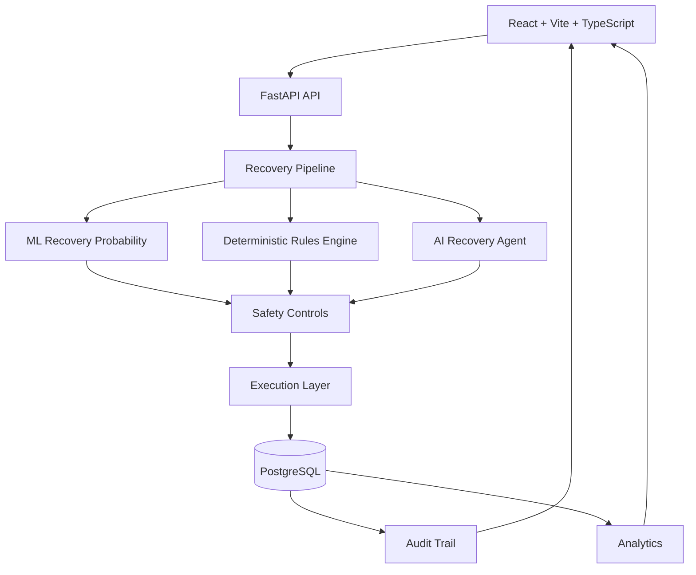

# ⚡ RecoverAI

### AI-Powered Failed Payment Recovery & Decision Intelligence Platform

> **AI recommends. Deterministic rules decide. Safety controls execution. Every recovery is auditable.**

RecoverAI is an end-to-end intelligent payment recovery platform built for the **Razorpay Buildathon**.

It transforms failed payments from a passive error state into an **intelligent recovery decision**.

Instead of blindly retrying every failed transaction, RecoverAI evaluates payment and customer context, estimates recovery probability, combines ML signals with an AI-assisted recommendation, applies deterministic safety policies, and then safely routes the transaction toward:

**RETRY · BLOCK · HUMAN APPROVAL**

Every decision and execution outcome is persisted and made observable through the dashboard, analytics, and audit trail.

---

## 🏆 The Idea

### Failed payment ≠ lost payment.

A failed payment can represent:

* a temporary network failure
* insufficient funds
* a bank decline
* authentication failure
* an expired card
* suspicious activity
* a high-value transaction requiring additional control

The challenge is not simply:

> **"Can we retry the payment?"**

The real question is:

> **"Should we retry this payment, when should we retry it, and can we do so safely?"**

RecoverAI is designed around that decision.

---

# 💡 From Payment Failure → Intelligent Recovery

```text
                    FAILED PAYMENT
                           │
                           ▼
              ┌────────────────────────┐
              │ Payment + Customer     │
              │ Context                 │
              └────────────┬───────────┘
                           │
                           ▼
              ┌────────────────────────┐
              │ ML Recovery Probability│
              └────────────┬───────────┘
                           │
                           ▼
              ┌────────────────────────┐
              │ Deterministic Rules    │
              │ Engine                  │
              └────────────┬───────────┘
                           │
                           ▼
              ┌────────────────────────┐
              │ AI Recovery Agent      │
              │ Recommendation         │
              └────────────┬───────────┘
                           │
                           ▼
              ┌────────────────────────┐
              │ Safety Validation      │
              └────────────┬───────────┘
                           │
             ┌─────────────┼─────────────┐
             ▼             ▼             ▼
          RETRY          BLOCK       HUMAN REVIEW
             │
             ▼
     Simulation / Razorpay
         Test Mode
             │
             ▼
       Persist Result
             │
       ┌─────┴─────┐
       ▼           ▼
   Audit Trail   Analytics
```

---

# 🎯 Why RecoverAI?

Traditional retry systems often treat payment failure as a simple boolean:

```text
FAILED → RETRY
```

RecoverAI treats recovery as a **decision problem**:

```text
FAILED
  ↓
How likely is recovery?
  ↓
What do deterministic policies allow?
  ↓
What does the AI recommend?
  ↓
Is the action safe?
  ↓
Does it require human approval?
  ↓
Can execution happen within defined boundaries?
```

This creates a recovery system that is:

| Capability             | RecoverAI |
| ---------------------- | --------- |
| Recovery intelligence  | ✅         |
| ML probability         | ✅         |
| AI recommendation      | ✅         |
| Deterministic rules    | ✅         |
| Hard-stop protection   | ✅         |
| High-value protection  | ✅         |
| Human approval         | ✅         |
| Retry limits           | ✅         |
| Idempotency            | ✅         |
| Simulation Mode        | ✅         |
| Razorpay Test Mode     | ✅         |
| Persistent audit trail | ✅         |
| Recovery analytics     | ✅         |

---

# 🧠 Decision Intelligence

RecoverAI separates **recommendation** from **authorization**.

### AI/ML answers:

> "How recoverable does this payment appear to be?"

### Rules answer:

> "Is recovery allowed?"

### Safety layer answers:

> "Is automatic execution safe?"

### Execution layer answers:

> "What actually happened?"

This separation is one of the core architectural principles of RecoverAI.

```text
                 AI / ML
                   │
                   │ Recommendation
                   ▼
        ┌──────────────────────┐
        │ Deterministic Rules  │
        └──────────┬───────────┘
                   │
                   │ Allowed?
                   ▼
        ┌──────────────────────┐
        │   Safety Controls    │
        └──────────┬───────────┘
                   │
             ┌─────┼─────┐
             ▼     ▼     ▼
           RETRY BLOCK HUMAN
```

**AI does not get unrestricted authority over payment execution.**

---

# 🛡️ Safety-First Payment Automation

Payment recovery is not just an AI problem.

It is a **risk-control problem**.

RecoverAI therefore preserves deterministic safety boundaries around automation.

### Core controls

* Maximum automated retries
* Minimum recovery probability
* High-value transaction threshold
* Hard-stop failure reasons
* Human approval
* Idempotency protection
* Database-level uniqueness
* Simulation/Test Mode execution

The exact thresholds and policies are configurable through the project's existing configuration.

### Example

Even if the ML system produces a high recovery probability:

```text
Recovery Probability = HIGH
             │
             ▼
    Hard-stop failure?
             │
       ┌─────┴─────┐
      YES           NO
       │             │
       ▼             ▼
     BLOCK      Continue evaluation
```

**Safety rules always remain part of the decision boundary.**

---

# 🔄 End-to-End Recovery Lifecycle

Every recovery follows the actual application pipeline:

### 01 — Detect

Identify the failed transaction.

### 02 — Understand

Retrieve payment and customer context.

### 03 — Predict

Generate the recovery probability.

### 04 — Evaluate

Apply deterministic business rules.

### 05 — Recommend

Generate an AI-assisted recovery action.

### 06 — Protect

Apply safety boundaries.

### 07 — Execute

Perform a controlled simulation or Razorpay Test Mode operation.

### 08 — Persist

Store the recovery outcome.

### 09 — Audit

Record the important events and decisions.

### 10 — Observe

Reflect the outcome in the dashboard and analytics.

---

# ✨ Product Capabilities

## 🤖 Recovery Intelligence

**ML Recovery Probability**

Estimate whether a failed payment is likely to be recoverable.

**AI Recovery Agent**

Provides an intelligent recommendation with decision context where supported by the implementation.

**Customer Context**

Recovery decisions can incorporate available customer/payment history.

---

## 🛡️ Safety & Governance

**Deterministic Rules Engine**

Business rules provide predictable boundaries around automation.

**Hard Stops**

Certain failure reasons can immediately prevent automated recovery.

**High-Value Protection**

High-value transactions can be routed for human approval.

**Retry Limits**

Repeated automated attempts are bounded.

**Idempotency**

Duplicate recovery attempts are protected at the persistence layer.

---

## 💳 Controlled Execution

RecoverAI supports safe Buildathon demonstration through:

### Simulation Mode

Run the complete recovery workflow without real payment movement.

### Razorpay Test Mode

Integrate with Razorpay's test environment when credentials are configured.

> **No real money is required for the demonstration.**

---

## 📊 Operations Intelligence

RecoverAI turns recovery activity into an operational view.

### Dashboard

Monitor recovery performance and payment risk.

### Failed Payments

Search, filter, sort, and inspect failed transactions.

### Payment Details

View transaction-level recovery context and outcomes.

### Analytics

Understand recovery outcomes, failure patterns, payment methods, and recovery performance.

### Audit Trail

Trace what happened during a recovery decision and execution.

---

# 🖥️ Application Experience

The frontend provides the operational interface for RecoverAI.

### `/dashboard`

High-level recovery overview including persisted recovery metrics.

### `/payments`

Failed-payment discovery, filtering, searching, and transaction inspection.

### Payment Details

Transaction-specific information including:

* transaction ID
* customer information
* amount
* payment method
* failure reason
* recovery probability
* retry information
* rules decision
* execution status
* recovered amount
* execution mode
* timestamps

### `/analytics`

Recovery performance and outcome analysis.

### Audit Information

Transaction-level recovery history and persisted audit events.

---

# 🧪 Realistic Demo Environment

RecoverAI includes a persisted demo dataset specifically designed to demonstrate different recovery decisions.

The seed dataset contains:

### **27 demo payments**

including deliberately designed recovery scenarios.

The data is stored in PostgreSQL rather than being hardcoded into the React frontend.

The seed process is designed to be repeatable and duplicate-safe.

---

# 🎬 Six Hero Scenarios

The project contains six primary scenarios designed to demonstrate the complete safety spectrum.

| Scenario               | Transaction                 | Demonstrates                   |
| ---------------------- | --------------------------- | ------------------------------ |
| 🟢 Successful Recovery | `TXN-DEMO-A`                | Automatic recovery success     |
| 🔴 Failed Recovery     | `TXN-DEMO-B`                | Recovery execution failure     |
| 🟡 Human Approval      | `TXN-DEMO-D`                | High-value safety protection   |
| ⛔ Hard Stop            | `pay_demo_hard_stop_fraud`  | Deterministic blocking         |
| 🔵 Low Probability     | `pay_demo_low_probability`  | Unsafe retry prevention        |
| 🟢 High Probability    | `pay_demo_high_probability` | Intelligent automatic recovery |

Additional max-retry scenario:

```text
TXN-DEMO-C
```

Detailed scenario information is available in:

```text
docs/DEMO_SCENARIOS.md
```

---

# 🎤 Recommended Buildathon Demo

### 5-minute judge walkthrough

```text
01  Dashboard
        ↓
02  Failed Payments
        ↓
03  High Probability Transaction
        ↓
04  Show ML Probability
        ↓
05  Show AI Recommendation
        ↓
06  Show Rules + Safety Decision
        ↓
07  Trigger Recovery
        ↓
08  Show Successful Execution
        ↓
09  Open Audit Trail
        ↓
10  Show Human Approval Scenario
        ↓
11  Show Hard-Stop Scenario
        ↓
12  Finish with Analytics
```

### The three strongest moments

#### 🟢 Intelligence

Show:

```text
pay_demo_high_probability
```

Demonstrate how the system identifies an appropriate recovery opportunity.

#### 🟡 Governance

Show:

```text
TXN-DEMO-D
```

Demonstrate that a high-value payment is not blindly automated.

#### 🔴 Safety

Show:

```text
pay_demo_hard_stop_fraud
```

Demonstrate that safety rules can block an unsafe recovery path.

---

# 🏗️ Technical Architecture



---

# 🧰 Technology Stack

| Layer                    | Technology                      |
| ------------------------ | ------------------------------- |
| Frontend                 | React                           |
| Build Tool               | Vite                            |
| Language                 | TypeScript                      |
| Backend                  | FastAPI                         |
| Language                 | Python                          |
| ORM                      | SQLAlchemy                      |
| Database                 | PostgreSQL                      |
| Payment Platform         | Razorpay                        |
| Execution                | Simulation / Razorpay Test Mode |
| API                      | REST                            |
| Testing                  | Pytest                          |
| Deployment Configuration | Render + Vercel                 |

The README reflects the technologies currently present in the repository.

---

# 📁 Repository Structure

```text
RecoverAI-Razorpay-Buildathon/
│
├── backend/
│   ├── app/
│   │   ├── api/
│   │   ├── core/
│   │   ├── db/
│   │   └── ...
│   │
│   ├── scripts/
│   │   ├── init_db.py
│   │   └── seed_demo_data.py
│   │
│   ├── tests/
│   ├── requirements.txt
│   └── ...
│
├── frontend/
│   ├── src/
│   ├── public/
│   ├── package.json
│   └── ...
│
├── data/
│
├── docs/
│   └── DEMO_SCENARIOS.md
│
├── render.yaml
├── .env.example
├── .gitignore
└── README.md
```

---

# ⚙️ Run RecoverAI Locally

RecoverAI is designed to run as a complete local stack:

```text
PostgreSQL
    +
FastAPI
    +
React
    =
RecoverAI
```

## Requirements

Install:

* Python
* PostgreSQL
* Node.js
* npm
* Git

---

## 1. Create PostgreSQL Database

Make sure PostgreSQL is running.

From Windows Command Prompt:

```cmd
psql -U postgres -c "CREATE DATABASE recoverai;"
```

If `psql` is not in PATH:

```cmd
"C:\Program Files\PostgreSQL\18\bin\psql.exe" -U postgres -c "CREATE DATABASE recoverai;"
```

Adjust the PostgreSQL version/path if required.

---

# 2. Configure Environment

Create a local `.env` file in the repository root.

Use `.env.example` as the reference.

Example:

```env
DATABASE_URL=postgresql+psycopg2://postgres:<YOUR_PASSWORD>@localhost:5432/recoverai
```

Never commit your real `.env`.

Backend integration variables may include:

```text
DATABASE_URL
CORS_ALLOW_ORIGINS
LLM_PROVIDER
RECOVERY_EXECUTOR
RAZORPAY_MODE
RAZORPAY_KEY_ID
RAZORPAY_KEY_SECRET
RAZORPAY_WEBHOOK_SECRET
```

Configure only the integrations required for your local setup.

---

# 3. Install Backend

```cmd
cd backend
python -m venv .venv
.venv\Scripts\activate
pip install -r requirements.txt
```

---

# 4. Initialize Database

```cmd
python -m scripts.init_db
```

---

# 5. Seed Demo Data

```cmd
python -m scripts.seed_demo_data
```

This populates PostgreSQL with the project's realistic demo payment scenarios.

---

# 6. Start Backend

```cmd
uvicorn app.main:app --reload --port 8000
```

Backend:

```text
http://localhost:8000
```

Health check:

```text
http://localhost:8000/health
```

---

# 7. Start Frontend

Open a second terminal:

```cmd
cd frontend
npm install
npm run dev
```

Frontend:

```text
http://localhost:5173
```

---

# 🔌 API Surface

The current backend exposes endpoints including:

| Method | Endpoint                             | Purpose                 |
| ------ | ------------------------------------ | ----------------------- |
| GET    | `/health`                            | Health check            |
| GET    | `/api/dashboard/summary`             | Dashboard summary       |
| GET    | `/api/analytics`                     | Analytics               |
| GET    | `/api/payments`                      | Payment listing         |
| GET    | `/api/payments/{transaction_id}`     | Payment details         |
| POST   | `/api/recovery/{transaction_id}`     | Trigger recovery        |
| GET    | `/api/recovery/{transaction_id}`     | Recovery status/details |
| GET    | `/api/audit`                         | Audit records           |
| GET    | `/api/audit/{transaction_id}`        | Transaction audit       |
| POST   | `/api/integrations/razorpay/webhook` | Razorpay webhook        |

Refer to the FastAPI implementation for exact request and response schemas.

---

# 🧾 Auditability

RecoverAI treats auditability as a first-class part of payment recovery.

A recovery can produce lifecycle events such as:

```text
recovery_started
        ↓
ml_probability_generated
        ↓
rules_evaluated
        ↓
agent_decision
        ↓
safety_check
        ↓
retry_approved / retry_blocked / human_approval_required
        ↓
execution_started
        ↓
execution_succeeded / execution_failed
        ↓
recovery_completed
```

The exact sequence depends on the actual recovery path.

This enables the system to answer:

* What happened?
* Why was recovery attempted?
* Why was it blocked?
* Was human approval required?
* Did execution succeed?
* How much was recovered?

---

# 📈 Data → Decision → Outcome

One of RecoverAI's core design principles is that the system closes the loop.

```text
PAYMENT DATA
     ↓
DECISION
     ↓
EXECUTION
     ↓
OUTCOME
     ↓
DATABASE
     ↓
ANALYTICS
     ↓
OPERATIONAL VISIBILITY
```

The result is not just a recommendation.

It is a **persisted, observable recovery lifecycle**.

---

# 🧪 Testing

Run backend tests:

```cmd
cd backend
python -m pytest tests/ -q
```

The repository has been verified with:

```text
175 passed
```

Build the frontend:

```cmd
cd frontend
npm run build
```

The frontend build has also been verified successfully in the prepared project state.

---

# 🚀 Deployment

The repository includes deployment configuration for:

```text
Frontend → Vercel
Backend  → Render
Database → PostgreSQL
```

Relevant configuration includes:

```text
render.yaml
frontend/vercel.json
```

For Vercel, configure the frontend API URL to point to the deployed backend.

Example:

```env
VITE_API_URL=<YOUR_RENDER_BACKEND_URL>
```

For Render, configure the backend environment variables and PostgreSQL connection.

### Important

The repository contains deployment configuration, but production deployment must be configured and verified using the respective accounts and credentials.

No claim of production deployment is made unless a verified live URL is provided.

---

# 🔐 Security Principles

RecoverAI follows these principles:

### Never expose secrets

Credentials belong in environment variables.

### Keep payment credentials backend-only

Razorpay secrets must never be exposed through the frontend.

### No real-money execution

Buildathon demonstrations should use Simulation Mode or Razorpay Test Mode.

### Preserve safety boundaries

AI recommendations must not bypass deterministic controls.

### Protect against duplicate recovery

Idempotency and database constraints help prevent duplicate recovery attempts.

---

# 🔮 Future Roadmap

RecoverAI can evolve toward a broader intelligent payment-recovery platform.

Potential future directions include:

### Adaptive Recovery

Learn optimal retry timing based on historical outcomes.

### Smarter Customer Segmentation

Identify customer-specific recovery patterns.

### Expanded Risk Signals

Combine additional payment and behavioral signals.

### Multi-Gateway Recovery

Extend the recovery architecture beyond a single payment provider.

### Production Observability

Add advanced monitoring, alerting, tracing, and operational controls.

### Human-in-the-Loop Automation

Build richer approval workflows for sensitive payment decisions.

These are future enhancements and are **not represented as currently implemented features**.

---

# 🏆 Why RecoverAI Matters

RecoverAI approaches failed-payment recovery as more than a retry problem.

It combines:

```text
             INTELLIGENCE
                  +
              GOVERNANCE
                  +
                SAFETY
                  +
             EXECUTION
                  +
             AUDITABILITY
```

The result is a system designed around a simple principle:

> ### **Recover revenue without losing control.**

RecoverAI doesn't ask AI to blindly move money.

It asks AI to help understand the recovery opportunity, applies deterministic controls to the decision, executes within defined boundaries, and records the outcome.

That is the foundation for responsible payment-recovery automation.

---

# 📚 Documentation

Detailed demo scenarios:

```text
docs/DEMO_SCENARIOS.md
```

Use this document to understand the prepared Buildathon transactions and expected recovery behavior.

---

# 👩‍💻 Built For

### Razorpay Buildathon

**Project:** RecoverAI
**Category:** AI-Powered Payment Recovery
**Repository:** RecoverAI-Razorpay-Buildathon

GitHub:

https://github.com/Priyankad15/RecoverAI-Razorpay-Buildathon

---

# ⭐ Final Takeaway

```text
FAILED PAYMENT
      ↓
UNDERSTAND
      ↓
PREDICT
      ↓
RECOMMEND
      ↓
PROTECT
      ↓
RECOVER
      ↓
AUDIT
      ↓
LEARN
```

### RecoverAI

**AI-powered recovery. Deterministic safety. Auditable execution.**

> **Don't just retry failed payments. Make recovery intelligent.**
